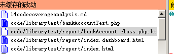

## 代码覆盖率分析

[官方文档](https://phpunit.de/manual/3.7/zh_cn/code-coverage-analysis.html)

需要使用到 [PHP_CodeCoverage](https://github.com/sebastianbergmann/php-code-coverage) 组件和 Xdebug 扩展

从上面的地址下载 PHP_CodeCoverage ，然后解压到你的PHPUnit目录下(比如我的是 /usr/local/php/lib/php/PHPUnit)

关于Xdebug 的安装，请自行搜索教程。

使用我们前面写过的测试文件 bankAccountTest.php，为其生成一份代码覆盖率的报告

```
[root@localhost librarytest]# phpunit --coverage-html ./report bankAccountTest.php
PHPUnit 3.7.22 by Sebastian Bergmann.

......

Time: 204 ms, Memory: 4.75Mb

OK (6 tests, 9 assertions)

Generating code coverage report in HTML format ... done
```


### 指明要覆盖的方法

使用 @covers 标注可以用在测试代码中，指明测试方法想要对哪些方法进行测试。如果提供这个信息，那么只有指定的方法的代码覆盖率信息会被统计。

具体是什么意思？不太清楚，测试一下不就知道了。首先我们先将当前的本地所以文件提交到git仓库，然后再修改 bankAccountTest.php 文件，按照官方文档的示例，给几个测试方法添加标注。然后把先前生成的 report复制到别的地方或者修改成别的名字，用于接下来的比较。

再运行 `phpunit --coverage-html ./report bankAccountTest.php` 命令。修改本地修改



好像并没有什么变化，再看接下的 @coversNothing 标注指定一个测试不覆盖的方法。按照官方文档继续修改 bankAccountTest.php 文件。为 testDepositMoney 方法添加 @coversNothing 标注，然后再运行生成覆盖率的命令。

好吧，又是看不出来有什么变化……

教程还有“忽略代码块”，“包含与排除文件”，“边缘情况”，但是目前还没有用到，跳过先。