## 快速入门

其实之前已经看过几次 PHPUnit 了，但没次都是看不到一半就放弃了，因为搞不懂……，但是这次，我一定要学会它。

我最开始使用测试的经验不是使用PHPUnit，而是来自C语言，C语言中有一个简单的断言函数 assert()，它的用法是这样的

```
// 一个简单的求和函数
function sum(int a,int b){
	return a + b;
}
```
怎么测试上面的函数呢？在C中，我通常是这样写的
```
assert(sum(5,6)==11);
```
如果上面的判断没有通过，那么就会 die() 掉。

通过上面的例子，我们可以简单地认为测试，就是将一些数据输入到函数中，然后把函数的输出与我们认为的正确答案相比较，如果比较结果是一样的，那么就是通过测试，如果比较结果不一样，那么就是测试不通过。

在使用 PHPUnit 时，需要遵循 PHPUnit 的一些规则。

1. 类 Class 的测试需要写在 ClassTest 中
2. ClassTest （通常）继承自 PHPUnit_Framework_TestCase
3. 测试的方法必须是 public 的，以 test* 作为方法名或者在注释块中使用 @test

首先是最简单的，把上面的求各函数转为能够被 PHPUnit 测试的代码，新建 sum.php ，并输入以下代码

```
class SumTest extends PHPUnit_Framework_TestCase{
	
	public function sum($a,$b){
		return $a + $b;
	}

	public function testSum(){
		$this->assertEquals($this->sum(5,6),11);
		$this->assertEquals($this->sum(11,22),33);
	}
}
```

然后使用 PHPUnit 执行这个文件

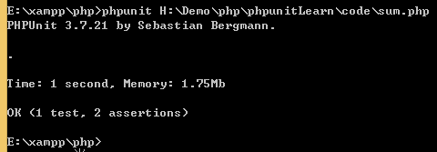

你看到我的命令那么长，那是因为我是直接打开控制台（管理员身份），然后到 PHPUnit 目录下执行它的，因为我还没有配置 path，所以命令才那么长

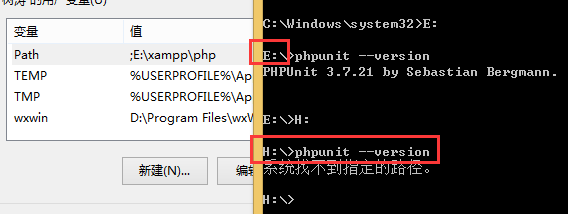

有没有发现一个很无耐的地方，只有进入PHPUnit所在的盘，才可以直接使用命令，否则提示找不到路径。所以我只能把代码转移到E盘了

上面的 assertEquals 方法就类似于C语言中的assert()，都是用来测试结果是否为真。只不过 PHPUnit 的 assertEquals 使用两个参数，而C的 assert 传的是一个表达式。

以下是另外一个简单的示例，是向我们的开发环境靠拢的。首先建立目录
```
|-- library/
|		|-- calculate.class.php
|-- librarytest/
|		|-- calculate.class.php
```

假设 library/ 目录存放的是我们在项目中要使用到的类，而 librarytest/ 目录则是存放用来测试 library/ 目录对应的类的。

```
// library/calculate.class.php
class Calculate{
	public function sum($a,$b){
		return $a + $b;
	}
}
```

```
// librarytest/calculate.class.php
require_once '../library/calculate.class.php';
class CalculateTest extends PHPUnit_Framework_TestCase{
	public function testSum(){
		$cal = new Calculate();
		$this->assertEquals($cal->sum(78,55),133);
		$this->assertEquals($cal->sum(79,51),129);//故意写错
	}
}
```

添加完代码后，再次用 PHPUnit 测试，结果如下

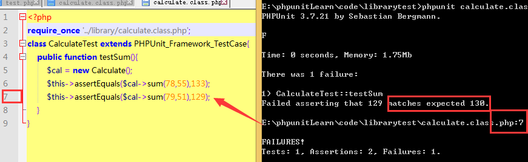

我们可以看到测试结果：提示了错误的行数，还有期待的值。

### 测试依赖

官方文档说：PHPUnit 允许生产者(producer)返回一个测试基境(fixture)的实例，并将此实例传递给依赖于它的消费者(consumer)们。

我的理解就是：依赖就像一条这样的食物链，一棵植物吸入各种营养元素，长出了一个果实，果实被人吃了，人拉出为屎，屎又被狗给吃了。

虽然这个例子恶心了点，但希望好歹能帮助你理解。PHPUnit 使用 @depends 来标注依赖关系，下面我们就来写这个例子吧，新建文件 depends.php。

```
class DependsTest extends PHPUnit_Framework_TestCase{
	public function testPlant(){
		$Foods = array();//食物
		$this->assertEmpty($Foods);//食物不需要吃
		array_push($Foods,'fruit');//长出了水果
		return $Foods;
	}
	/**
	 * @depends testPlant
	 */
	public function testPerson(array $Food){
		//检查是不是有水果可以吃
		$this->assertEquals(array_pop($Food),'fruit');
		//吃完水果拉出XX，再把XX扔出去
		array_push($Food,'XX');
		return $Food;
	}
	/**
	 * @depends testPerson
	 */
	public function testDog(array $Foods){
		$this->assertEquals(array_pop($Foods),'XX');
		//检查是不是吃完了
		$this->assertEmpty($Foods);
	}
}
```

终于写完了，测试一下成果吧

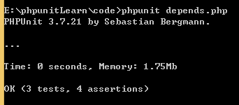

##### 多重依赖

Iphone6都出了这么久了，好想买一台呀。但是5000大洋呀，没钱，怎么办呢，只能跟死党A，B，C借了，结果死党们爽块地答应了。拿到借来的3堆零钱，我们得先算下，数额够不够。

```
//iphone6.php
class Iphone6Test extends PHPUnit_Framework_TestCase{
	public function testA(){
		return 2000;
	}
	public function testB(){
		return 2500;
	}
	public function testC(){
		return 499;
	}
	/**
	 * @depends testA
	 * @depends testB
	 * @depends testC
	 */
	public function testAll(){
		//测试函数的前部分是我们想要的值，后面是事实上的值
		$this->assertEquals(array(2000,2500,499),func_get_args());
		$this->assertGreaterThanOrEqual(5000,array_sum(func_get_args()));
	}
}
```

赶快测试一下

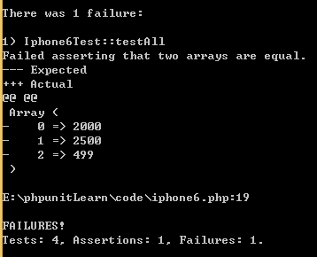

那尼！居然少于5000，看来 iphone6 是买不到了

##### 小结
1. A函数依赖于B函数，则只有B函数顺序通过测试，A函数才会开始测试
2. B函数可以把结果传递给A函数，A函数可以通过形参（多个依赖时用func_get_args())获取B传递过来的值

#### 数据供给器

什么是数据供给器？就是为测试方法提供测试数据的方法。它只有一个特点，那就是它的返回值是一个数组的数组（array(array(),...)，或者是一个实现了 Iterator 接口的对象。首先我们还是从简单的地方入手，比如返回一个数组的数组，我觉得我肯定可以轻松搞定的。PHPUnit 使用 @dataProvider 来为函数指明想使用哪个数据供给器。

```
//provider.php
class ProviderTest extends PHPUnit_Framework_TestCase{
	//首先是写一个返回数组的数组的方法，作为数据供给器，因为它需要被测试，所以不需要以test开头啦
	public function dataProvider(){
		return array(
			array(2,4,6),
			array(7,15,22),
			array(9,7,16)
		);
	}
	/**
	 * @dataProvider dataProvider
	 */
	public function testSum($a,$b,$sum){
		$this->assertEquals($a + $b,$sum);
	}
}
```

运行一下，我就说嘛，这么简单的问题是不可能出错的

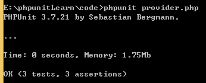

接下来是迭代器，什么是迭代器呢？我还是查一下 PHP 手册好了。在PHP手册中可以看到

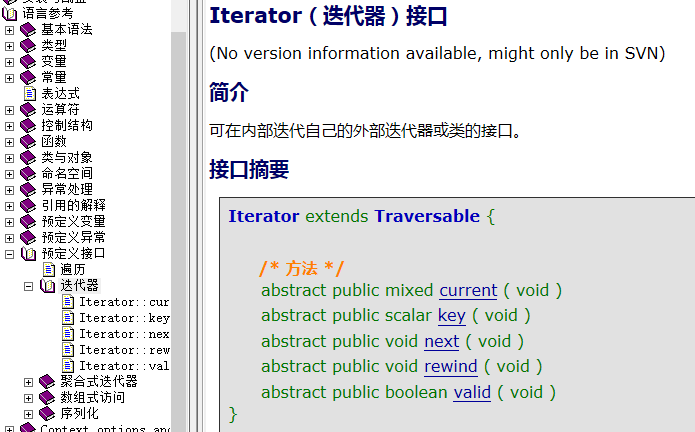

那我们就直接参考手册上的那个 xml 文件例子吧，首先是准备文件，就叫 book.xml吧
```
<?xml version="1.0" encoding="UTF-8"?>
<data>
	<book>
		<author>高洛峰</author>
		<title>细说PHP（第2版）</title>
		<price>100</price>
	</book>
	<book>
		<author>汤姆森,威利</author>
		<title>php和mysql web开发</title>
		<price>95</price>
	</book>
	<book>
		<author>麦金太尔</author>
		<title>PHP编程实战</title>
		<price>69</price>
	</book>
</data>
```
OK，上面就是我们的数据文件，接下来要写一个迭代器，就叫 bookIterator.php，直接从php手册中将代码复制出来，再修改成符合我们需求的
```
class bookXML implements Iterator {
	//首先我们有5个方法需要实现
	//移到首元素
	public function rewind(){
		$this->position = 0;
	}
	private $position;//当前位置
	//返回当前元素值
	public function current(){
		$this->xml->data->book[$this->position];
	}
	private $xml;
	public function __construct() {
        $this->position = 0;
        $this->xml = simplexml_load_file('book.xml');   
    }
	//返回当前元素键
	public function key(){
		$this->position;
	}
	//下移一个元素
	public function next(){
		++$this->position;
	}
	//判定是否还有后续元素, 如果有, 返回true
	public function valid(){
		return isset($this->xml->data->book[$this->position]);
	}
}
```

好了，我们的xml迭代器已经完成了，现在要将它作为数据供给器给我们的 bookProvider.php 文件使用。

```
require_once 'bookIterator.php';

class bookProviderTest extends PHPUnit_Framework_TestCase{
	public function bookList(){
		return new bookXML();
	}
	
	/**
	 * @dataProvider bookList
	 */
	public function testBook($author,$title,$price){
		//作者不少于3个字
		$this->assertGreaterThanOrEqual(3,strlen($author));
		//标题不少于5个字
		$this->assertGreaterThanOrEqual(5,strlen($title));
		//价格不少于50元
		$this->assertGreaterThanOrEqual(50,intval($price));
	}
}
```

好了，运行代码吧，结果居然提示

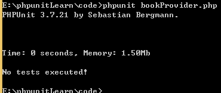

这是为什么呢？仔细检查一下，原来是我们的迭代方法，valid,key,current 是要使用 return 的，是我大意了。给这几个方法添加上 return ，再次运行。

还是不行呀，继续显示 "No tests executed!"，是不是我们的 数据供给器 返回的结果有问题呢？继续修改调试

```
//直接返回数组的数组测试一下
public function bookList(){
	//return new bookXML; 注释掉可能产生问题的代码
	return array(
		array("author1","book1",65),
		array("author2","book2",75),
		array("author3","book3",85)
	);
}
```
居然显示成功了

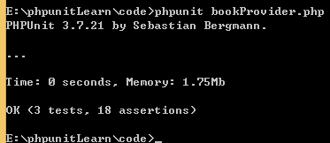

那么问题就出在这个 return new bookXML()上了。那我们就在 bookIterator.php 添加下面代码，用 foreach 将它迭代下，看输出什么吧。

```
$bookXML = new bookXML();
foreach($bookXML as $k => $v){
	echo PHP_EOF.$k.PHP_EOF;
	printf($v);
}
```
然后使用php命令（注意不是PHPUnit命令）来运行它，又是啥都没有，继续修改
```
echo "Start...\r\n";
$bookXML = new bookXML();
print_r($bookXML->xml);
echo "End...\r\n";
```
再次运行，这次可能看到结果了

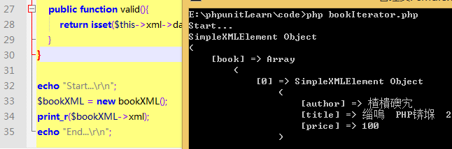

也看到问题所在了，回想一下 @dataProvider 是需要返回什么类型的数据?数组的数组，而现在我们返回的是什么类型，是 SimpleXML Object 而不是 array 呀，所以我们现在的问题是 How to Converting a SimpleXML Object to an Array。解决了这个问题后，我们再次使用我们的 PHPUnit 命令，结果如下

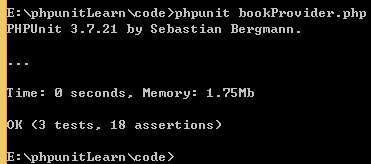

终于解决了这个对象迭代的问题了，文件在这里，如果你修改后还是测试失败，可以随时查阅

* [bookIterator.php](./code/bookIterator.php)
* [bookProvider.php](./code/bookProvider.php)

##### 小结
数据供给器 @dataProvider 为函数指定测试数据的来源，而且数据必须为数组的数组形式。

那么 @dataProvider 和 @depends 有什么区别呢？

1. 都可以接收另一个函数返回的数据
2. @dataProvider 只接收数组的数组，而 @depends 不限制
3. @depends 可以指定多个，通过 func_get_args 获取

下面，我们同时使用 @dataProvider 和 @depends 进行测试，这次我们采用的是官方的例子。

```
//dependsAndProvider.php
class DependsAndProviderTest extends PHPUnit_framework_TestCase{
	// provider 要返回一个数组的数组
	public function provider(){
		return array(
			array('provider1'),
			array('provider2')
			);
	}
	// depends1 可以返回任意格式的值
	public function testDepends1(){
		$this->assertTrue(true);
		return 'first';
	}
	// depends2
	public function testDepends2(){
		$this->assertTrue(true);
		return 'second';
	}
	/**
	 * @depends testDepends1
	 * @depends testDepends2
	 * @dataProvider provider
	 */
	public function testConsumer(){
		$this->assertEquals(
				array('provider1','first','second'),
				func_get_args()
			);
	}
}
```
测试结果当然是失败的啦，这个不用怀疑。首先查看下错误提示，
```
FAILURES!
Tests: 4, Assertions: 4, Failures: 1.
```
考虑：为什么会有4次test呢？

答：因为数据供给器迭代了2次，再加上2个 @depends 所以就有4次啦

尝试将它修改为正确的

思考：因为 @dataProvider 迭代了2次，所以 func_get_args 两次获取的值分别为 array('provider1','first','second') 和 array('provider2','first','second') ，所以如果只是简单地使用一个 assertEquals 恐怕是没办法改正的。因此我们需要使用到 func_get_arg(int) 来代替迭代的那部分，假设我们有下面一个函数
```
function dataExpect(){
	return array('provider1','provider2');
}
```
如果用它来验证 testConsumer() 呢？作为数据供给器？不能，因为返回的数组格式就是错误的。作为依赖？也不行，因为返回的数据被拆成一个个参数，不再是数组的形式。那就……作为普通的函数被 testConsumer() 使用就OK了。好，就按这个思路来修改。首先在PHPUnit 手册上查找 [断言](https://phpunit.de/manual/current/zh_cn/appendixes.assertions.html)部分，看是有什么函数可以供我们使用。最后发现 assertContains() 好像符合我们的要求。嗯，就选它，修改代码和测试结果如下

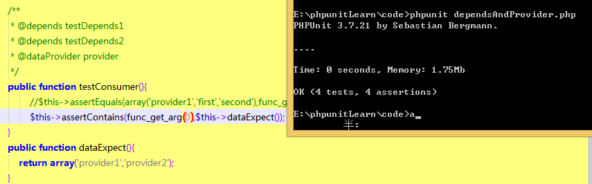

我们关注的重点是：@dataProvider 优先级比 @depends 要高。此外，还有一个问题：可以有两个 @dataProvider 吗？把上面的代码修改一下，复制 provider() 函数，同时在 testConsumer 中再添加一个 @dataProvider ，主要代码变成这样

```
	/**
	* @dataProvider provider2
	 * @depends testDepends1
	 * @depends testDepends2
	 * @dataProvider provider
	 */
	public function testConsumer(){
			//$this->assertEquals(array('provider1','first','second'),func_get_args());
			$this->assertContains(func_get_arg(0),$this->dataExpect());
	}
	public function dataExpect(){
		return array('provider1','provider2','provider3','provider4');
	}
	public function provider2(){
		return array(array('provider3'),array('provider4'));
	}
```

理论上感觉应该是OK的，那么事实上呢？测试下就知道，go...，结果显示
```
OK (4 tests, 4 assertions)
```

咦，好像是正常的哦，But……为什么是4 tests，而不是6 tests,我们有2个迭代器（4次），2个依赖呀，结果应该是6而不是4。继续修改代码，看看是哪里错了
```
public function testConsumer(){
		$this->assertEquals(
			array('provider1'),func_get_arg(0));
	
```
再次运行，错误提示如下
```
There were 2 failures:

1) DependsAndProviderTest::testConsumer with data set #0 ('provider3')
'provider3' does not match expected type "array".

E:\phpunitLearn\code\dependsAndProvider.php:29

2) DependsAndProviderTest::testConsumer with data set #1 ('provider4')
'provider4' does not match expected type "array".

E:\phpunitLearn\code\dependsAndProvider.php:29

FAILURES!
Tests: 4, Assertions: 4, Failures: 2.
```

只出现了 provider3 和 provider4 ，这证明了数据供给器只能有1个。