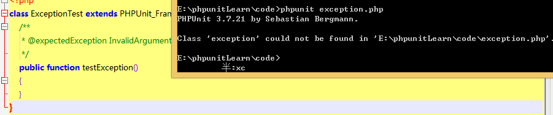
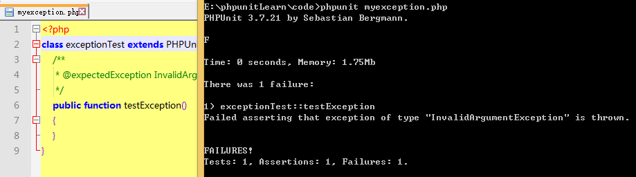
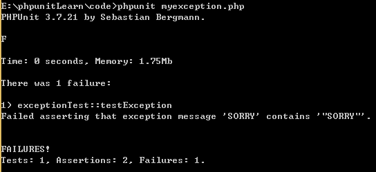
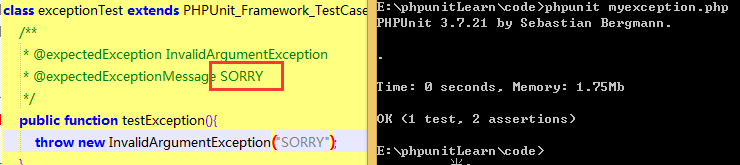
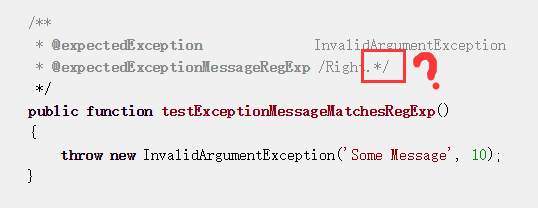
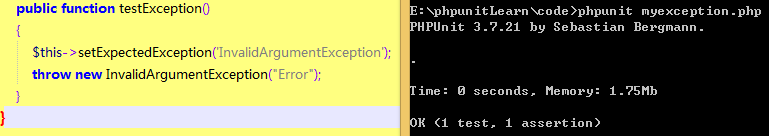
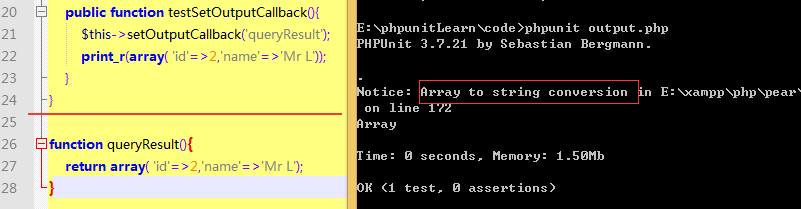

### 对异常进行测试

官方文档只用一句话向我们解释异常测试：用 @expectedException 标不来测试代码中否抛出了异常。

但我们的问题还有很多呀，比如：为什么要对异常进行测试呢？测了有什么用呢？看来这些问题只能留给我们自己解答了。好，那下面我们就通过代码来探求这些问题的答案吧。首先，还是按照官方文档一步步来

```
//exception.php
class ExceptionTest extends PHPUnit_Framework_TestCase{
    /**
     * @expectedException InvalidArgumentException
     */
    public function testException()
    {
    }
}
```



坑爹呀，居然跟官方的运行结果不一样！错误提示
```
Class 'exception' could not be found in 'E:\phpunitLearn\code\exception.php'.
```
难道是我文件名字起错了？好，修改文件名为 myexception.php



果然是个坑呀，文件名也不能随便给的……，注意到错误信息

```
Failed asserting that exception of type "InvalidArgumentException" is thrown.
```

因为没有收到期望抛出的异常类型，那是不是说如我们在 testException() 中抛出期望的异常，就可以通过测试了？什么是 "InvalidArgumentException" 呢？查看下 PHP 手册，PHP手册的解释是"Exception thrown if an argument does not match with the expected value. "，参数与期待的值不匹配，查看手册示例
```
function tripleInteger($int)
 {
   if(!is_int($int))
     throw new InvalidArgumentException('tripleInteger function only accepts integers. Input was: '.$int);
   return $int * 3;
 }

$x = tripleInteger(4); //$x == 12
$x = tripleInteger(2.5); //exception will be thrown as 2.5 is a float
$x = tripleInteger('foo'); //exception will be thrown as 'foo' is a string
$x = tripleInteger('4'); //exception will throw as '4' is also a string
```

哦，有点明白了，那开始侯代码


那我大概知道为什么需要对异常进行测试了。在上一节 [编写PHPUnit测试1](2start.md) 中，我们使用的都是正向测试，也就是我提供正确的数据，代码就应该得到正确的结果，比如有一个判断参数是否为偶数的函数。我传入参数10，你返回说是一个偶数，这没问题。但如果我传入参数11，你还是告诉说这个一个偶数，那就有问题了。异常就是为了解决这种反向测试的吧，我是这样理解的。

现在我们解决了异常测试的用途了，接下来继续看教程。对于异常，还可以使用 *@expectedExceptionMessage* 、 *@expectedExceptionMessageRegExp*  和 *@expectedExceptionCode* 标注.这又是什么意思？

首先是 @expectedExceptionMessage 字面理解，大概是抛出的异常信息，那是不是说此标记后面带的信息，必须跟我们在函数中执行的信息是一样的呢？修改 myexception.php 的代码如下

```
class exceptionTest extends PHPUnit_Framework_TestCase{
    /**
     * @expectedException InvalidArgumentException
	 * @expectedExceptionMessage "SORRY"
     */
    public function testException(){
		throw new InvalidArgumentException('其实我要的是一个整数');
    }
}
```
运行测试，结果为：FAILURES;再修改 InvalidArgumentException('SORRY'); 再次运行



又失败，看来是符号的问题了



看，这次搞定了，又了这些基础，那么其它两个标注就应该也不成问题了。

```
/**
* @expectedException InvalidArgumentException
* @expectedExceptionMessage SORRY
* @expectedExceptionCode 50
*/
public function testException(){
	throw new InvalidArgumentException("SORRY",50);
}
//结果：OK (1 test, 3 assertions)
```
而对于 expectedExceptionMessageRegExp，官方的示例是，确定这样没有问题吗？

```
/**
* @expectedException InvalidArgumentException
* @expectedExceptionMessageRegExp  /SO.*/
* @expectedExceptionCode 50
*/
public function testException(){
	throw new InvalidArgumentException("SORRY",50);
}
//结果：Parse error: syntax error, unexpected '*', expecting function (T_FUNCTION)
```

直接给个语法错误，那该怎么使用正则呢？

```
expectedExceptionMessageRegExp  /SO/
结果：OK (1 test, 2 assertions)
expectedExceptionMessageRegExp  /\d+/
结果：OK (1 test, 2 assertions)
```
这明显错了呀！2个断言，一个是断言异常类型，一个是断言异常代码。那 @expectedExceptionMessageRegExp 标注没有用到，直接被忽略掉了。暂时不理它，再来看看 PHPunit 提供的对异常进行测试的方法

```
void setExpectedException(
	string $exceptionName
	[, string $exceptionMessage = '', integer $exceptionCode = NULL])

void setExpectedExceptionRegExp(
	string $exceptionName
	[, string $exceptionMessageRegExp = '', integer $exceptionCode = NULL])

String getExpectedException()
```

这3个函数应该怎么用呢？,首先看第1个函数 setExpectedException，来自官方手册的函数

```
public function testException(){
        $this->setExpectedException('InvalidArgumentException');
}

//运行结果
Failed asserting that exception of type "InvalidArgumentException" is thrown.
FAILURES!
Tests: 1, Assertions: 1, Failures: 1.
```
我们的任务就是将它修改为正确的，修改代码如下



也就是说，所以这个函数，就可以不必使用 @expectedException 的标注了。那么 setExpectedExceptionRegExp() 也应该具有同样的功能了。自已尝试写一个测试代码吧。

很遗憾的是，可能由于版本问题，并没有 setExpectedExceptionRegExp() 函数
```
public function testException(){
    $this->setExpectedExceptionRegExp('InvalidArgumentException','/ER.*/',10);
throw new InvalidArgumentException("Error");
}
//结果
Fatal error: Call to undefined method exceptionTest::setExpectedExceptionRegExp(
) in E:\phpunitLearn\code\myexception.php on line 21
```

另外还有一种用来测试异常的方法，请看实例代码
```
public function testException() {
  try {
      //这里需要填写什么才能让测试通过？
  }catch (InvalidArgumentException $expected) {
      return;
  }
  $this->fail('unknow Exception');
}
```

学了这么久，我想你一定可以补上让测试通过的代码了吧。如果你还不知道怎么写，那么建议看完这一节的小结后，将本章从头看一遍。

#### 小结

上面我们学习了测试异常的3种方法，分别是

1. 通过 @expectedException 标注
2. 通过 $this->setExpectedException() 函数
3. 通过 try{ ... }catch(){ ... }

### 对错误进行测试

默认情况下，PHPUnit 将测试在执行中触发的 PHP 错误（ *PHPUnit_Framework_Error* ）、警告（ *PHPUnit_Framework_Error_Warning* ）、通知（ *PHPUnit_Framework_Error_Notice* ）都转换为异常。但是在这里，我有个小疑问，通常我们在运行PHP脚本的时候，出现错误通常是以下的情况。比如语法错误啦，数据库连接语句错误，找不到文件啦。这些情况通常是直接就die()掉了呀，通道还可以在die()之后通过 PHPunit 再次运行代码？那这里的错误，是指什么类型的错误呢？

注意：PHP 的 error_reporting 运行时配置会对 PHPUnit 将哪些错误转换为异常有所限制。如果在这个特性上碰到问题，请确认 PHP 的配置中没有抑制想要测试的错误类型。（来自官方）

我们还是直接看官方给的示例代码吧

```
//myexceptionError.php
class ExpectedErrorTest extends PHPUnit_Framework_TestCase{
    /**
     * @expectedException PHPUnit_Framework_Error
     */
    public function testFailingInclude(){
        include 'not_existing_file.php';
    }
}
//运行结果：OK (1 test, 1 assertion)
```

那好，现在我们的问题就是：Why? 我们为什么要使用这种错误，如果我的代码没有包含到脚本，应该让它提示我呀，而不是让它通过测试呀。错误测试的意义在哪里呢？带着疑问，继续阅读官方教程。

官方说：通过抑制住错误通知，就能对返回值进行检查，否则错误通知将会导致抛出PHPUnit_Framework_Error_Notice。

也就是说，错误测试的意义在于让测试继续进行，而不会因为 PHP 错误而中断测试。好吧，我想我是不会在脚本中使用到这个功能的，我还是喜欢有错误就停止脚本那种处理方式。

### 对输出进行测试

PHPunit 用 expectOutputString() 方法来设定所预期的输出。如果没有产生预期的输出，测试将计为失败。实际的输出是通过echo()，print()函数打印出来的。下面一起来看官方的代码

```
//output.php
class OutputTest extends PHPUnit_Framework_TestCase{
    public function testExpectFooActualFoo(){
        $this->expectOutputString('foo');
        print 'foo';
    }

    public function testExpectBarActualBaz(){
        $this->expectOutputString('bar');
        print 'baz';//not bar
    }
}
```
代码是如此简单，我都不想运行了。直接看 PHPunit 还为输出测试提供了哪些方法。

```
//设定输出预期与 $regularExpression 正则表达式匹配。
void expectOutputRegex(string $regularExpression)
//设定输出预期与 $expectedString 字符串相等。
void expectOutputString(string $expectedString)
//设定回调函数，用于，比如说，将实际输出规范化。
bool setOutputCallback(callable $callback)// why bool
```
仿照异常测试的方法，我们来为这几个函数写写代码吧。

```
public function testExpectOutputRegex(){
	$this->expectOutputRegex('|llo|');
	echo "Hello World!";
}
//结果：OK (1 test, 1 assertion)
```



注意到 callable 函数是在类的外部。