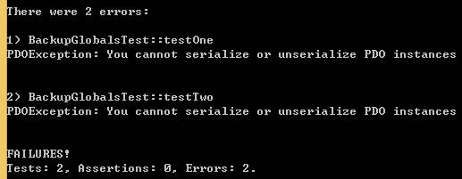
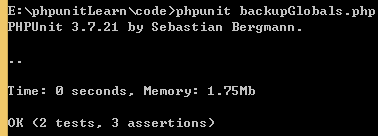
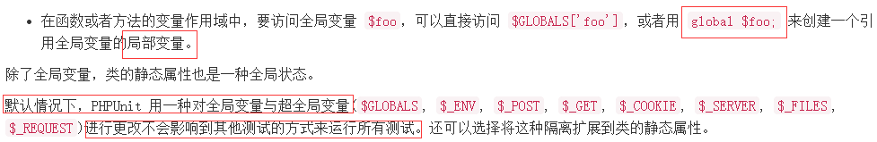
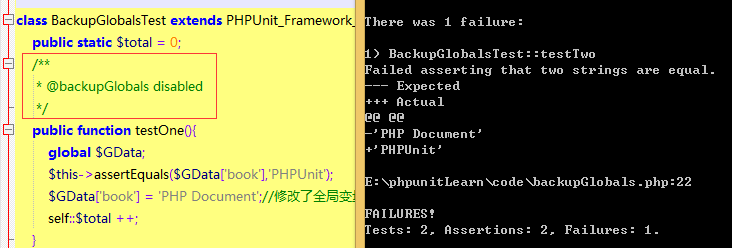
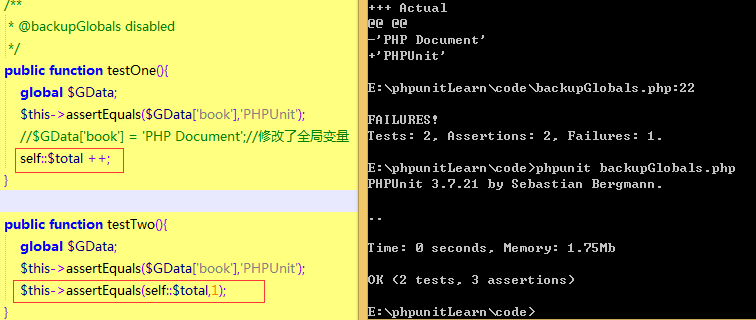
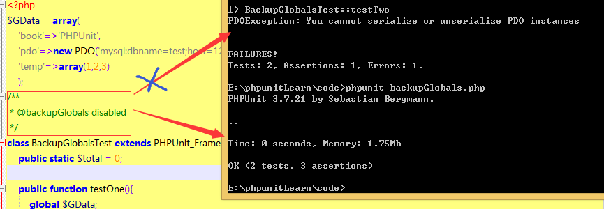
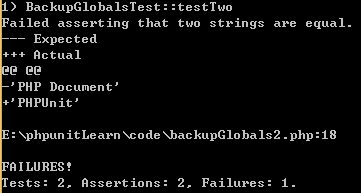
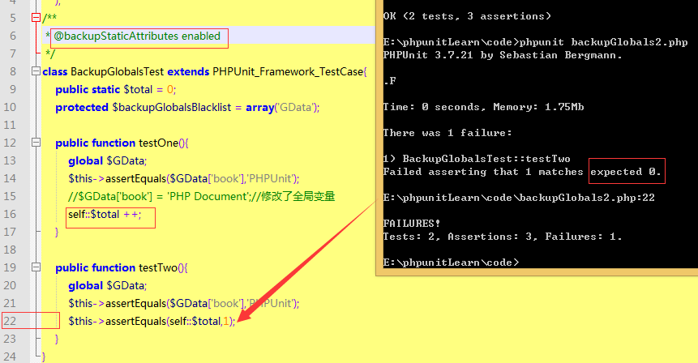

## 基境

[官方手册](https://phpunit.de/manual/current/zh_cn/fixtures.html) 官方很多版本的手册：4.6(alpha) , 4.5(beta), 4.4(stable),4.1(alpha),4.0(beta),3.7(stable)

之前我看的一直是4.4的版本，好吧，我错了，我应该看3.7的。你可以打开官方手册，然后一边看手册，一边看教程。

我们的测试流程是这样的：初始状态 -> 已知状态（测试数据） -> 测试 -> 测试结束 -> 初始状态（清除数据）

基境指的就是已知状态这一部分。在前面的教程中，我们使用到的数据都是很简单的，比如一个数组或一个字符串呀，但是在真实环境下，测试数据就要复杂得多了。

PHPUnit 支持共享建立基境的代码。在运行某个测试方法前，会调用一个名叫 setUp() 的模板方法。 setUp() 是创建测试所用对象的地方。当测试方法运行结束后，不管是成功还是失败，都会调用另外一个名叫 tearDown() 的模板方法。tearDown() 是清理测试所用对象的地方。（官方）

这里的 setUp() 和 tearDown() 就好似类中的 __construct() 和 __destruct() 方法。

首先，还是来看官方的实例代码吧，有时代码更能帮助我们理解整个过程
```
//StackTest.php
class StackTest extends PHPUnit_Framework_TestCase{
    protected $stack;

    protected function setUp(){
        $this->stack = array();
    }

    public function testEmpty(){
        $this->assertTrue(empty($this->stack));
    }

    public function testPush(){
        array_push($this->stack, 'foo');
        $this->assertEquals('foo', $this->stack[count($this->stack)-1]);
        $this->assertFalse(empty($this->stack));
    }

    public function testPop(){
        array_push($this->stack, 'foo');
        $this->assertEquals('foo', array_pop($this->stack));
        $this->assertTrue(empty($this->stack));
    }
}
```

如果把上面的代码看成一个简单的类，是不是感觉很好理解，就是普通的方法，普通的属性。只不过在用 PHPUnit 来运行时，特殊方法 setUp() 就具有了创建一份供每个 test* 方法调用的测试数据的功能。也就是说上面的3个方法的调用过程是这样的
```
//testEmpty()的运行过程
new StackTest() -> setUp() -> testEmpty()
//testPush()的运行过程
new StackTest() -> setUp() -> testPush()
//testPop()的运行过程
new StackTest() -> setUp() -> testPop()
//如果还有 tearDown() 方法，那就是下面这样
new StackTest() -> setUp() -> test*() -> tearDown()
```

此外，还有两个静态方法 setUpBeforeClass() 和 tearDownAfterClass()，那它们跟上面的 setUp() 和 tearDown() 又有什么关系呢？执行顺序又是怎么样的？下面我们通过代码打印出这个流程

```
//setUpAndDown.php
class setUpAndDownTest extends PHPUnit_Framework_TestCase {
	public function __construct(){ echo __METHOD__.' -> ';}
	public function __destruct(){ echo __METHOD__.' -> ';}
	public function setUp(){ echo __METHOD__.' -> ';}
	public function tearDown(){ echo __METHOD__.' -> ';}
	public static function setUpBeforeClass(){ echo __METHOD__.' -> ';}
	public static function tearDownAfterClass(){ echo __METHOD__.' -> ';}
	public function testOne(){ echo __METHOD__.' -> ';}
	public function testTwo(){ echo __METHOD__.' -> ';}
}
//执行结果如下
/*
setUpAndDownTest::__construct -> setUpAndDownTest::__construct -> PHPUnit 3.7.21
 by Sebastian Bergmann.

setUpAndDownTest::setUpBeforeClass ->

.setUpAndDownTest::setUp -> 
setUpAndDownTest::testOne -> 
setUpAndDownTest::tearDown ->

.setUpAndDownTest::setUp -> 
setUpAndDownTest::testTwo -> 
setUpAndDownTest::tearDown ->

setUpAndDownTest::tearDownAfterClass ->

Time: 0 seconds, Memory: 1.75Mb

OK (2 tests, 0 assertions)
setUpAndDownTest::__destruct -> setUpAndDownTest::__destruct ->
*/
```

通过上面的代码，我们就可以知道整个测试脚本中函数运行的流程了
```
__construct() -> setUpBeforeClass() ->
for: setUp() -> test*() -> tearDown()->
tearDownAfterClass() -> __destruct()
```

只有在用到文件之类的外部资源时，才需要使用 tearDown() 来进行关闭。而 setUpBeforeClass() 则通常用来建立数据库连接。如下面的代码（官方代码）

```
//在同一个测试套件内的不同测试之间共享基境
class DatabaseTest extends PHPUnit_Framework_TestCase{
    protected static $dbh;

    public static function setUpBeforeClass(){
        self::$dbh = new PDO('sqlite::memory:');
    }

    public static function tearDownAfterClass(){
        self::$dbh = NULL;
    }
}
```

## 全局状态

全局变量有优点，也有缺点。缺点就是这个全局变量可能会被测试方法修改，从而导致另一个使用到全局变量的测试方法失败。这个缺点也是一个优点，那就是数据的传递了。类的静态属性也是一种全局状态。考虑到全局状态可能对其它测试方法的影响，所以有的时候需要对其进行隔离。

PHPUnit 提供了哪些方法来隔离全局状态的影响呢？

1.使用 @backupGlobals 标注来控制对全局变量的备份与还原操作

因为官方没有提供完整的代码，所以我们需要自己来构造代码

```
//backupGlobals.php
$GData = array(
	'book'=>'PHPUnit',
	'pdo'=>new PDO('mysql:dbname=test;host=127.0.0.1','root',''),
	'temp'=>array(1,2,3)
	);
class BackupGlobalsTest extends PHPUnit_Framework_TestCase{
	public static $total = 0;

	public function testOne(){
		global $GData;
		$this->assertEquals($GData['book'],'PHPUnit');
		$GData['book'] = 'PHP Document';//修改了全局变量
		self::$total ++;
	}

	public function testTwo(){
		global $GData;
		$this->assertEquals($GData['book'],'PHPUnit');
		$this->assertEquals(self::$total,1);
	}
}
```

运行上面的代码，结果如下



看来 PDO 那行代码有点问题，直接注释掉它，然后再次运行



啊，这不合理呀，为什么是正确通过呢，全局变量居然没有被修改。仔细查找原因，在官网上找到这样一段话



现在，我偏要让它修改全局状态，该怎么修改呢？即然PHPUnit默认是打开全局备份的，那我们直接把它关闭不就OK了。使用 @backupGlobals disabled 标记关闭它。



在上面代码基础上，将 $GData['book'] = 'PHP Document'; 这一行注释掉，因为上面虽然我们关闭了全局状态备份，但是我们还没有测出类的静态属性 $total 是不是也是同样的情况。静态属性也属于全局状态，但我还是要测试一下



好，现在再来看看最开始的错误提示 "PDOException: You cannot serialize or unserialize PDO instances"（无法序列或反序列PDO实例）是怎么回事。

在官方文档中找到大大的注意：在使用备份与还原操作时，某些类的实例对象（比如 PDO）无法序列化。即然如此，那就从类的级别上关闭备份啦。修改代码如下。



2.PHPUnit提供了一个全局变量的黑名单，黑名单中的全局变量不会被备份还原

新建下面的代码示例文件

```
//backupGlobals2.php
$GData = array(
	'book'=>'PHPUnit',
	);
class BackupGlobalsTest extends PHPUnit_Framework_TestCase{
	public static $total = 0;
	// 一个全局变量黑名单
	protected $backupGlobalsBlacklist = array('GData');
	public function testOne(){
		global $GData;
		$this->assertEquals($GData['book'],'PHPUnit');
		$GData['book'] = 'PHP Document';//修改了全局变量
		self::$total ++;
	}

	public function testTwo(){
		global $GData;
		$this->assertEquals($GData['book'],'PHPUnit');
		$this->assertEquals(self::$total,1);
	}
}
```
测试结果如下



很好，是我们期望的结果。

3.使用 @backupStaticAttributes，在每个测试之前备份所有已声明的类的静态属性的值，并在测试完成之后全部恢复。它可以用在测试用例类或测试方法级别。

好，继续修改我们的 backupGlobals2.php 文件



4.静态属性的备份还原白名单 $backupStaticAttributesBlacklist 变量，可以参考全局变量的黑名单，自已测试一下代码。也可以查看我的 [backupGlobals2.php](./code/backupGlobals2.php) 文件

### 总结

1.如何建立基境，跟基境有关的4个函数分别是什么？它们之间的运行顺序是什么样的？跟测试方法的运行顺序又是什么样的？

2.对于全局状况，PHPUnit 提供了哪4种定全局变量/类静态属性 的备份与还原方法呢？全局变量的备份还默认是开启还是关闭？类的静态属性默认又是开启还是关闭的呢？

答：全局变量备份还原默认开启，类的静态属性默认是关闭的。

全局变量：

@backupGlobals enable（默认）/disabled

黑名单 $backupGlobalsBlacklist

静态属性

@backupStaticAttributes enable/disabled（默认）

白名单 @backupStaticAttributesBlacklist

