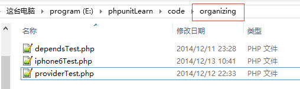
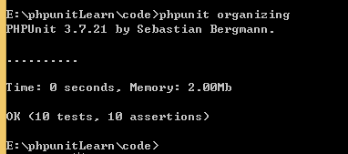

## 组织测试

在之前所有的测试中，我们每次都只是测试一次文件，用来学习 PHPUnit 的知识还好，如果是在实际开发中，难道我们还要一个文件一个文件地输入命令进行测试吗？那肯定是不可以的啦。我们希望在 PHPUnit 中存在某种方法，可以让我们一次测试就可以测试N多的文件，甚至是一条命令就搞定了整个项目的所有测试。

我们这节课的任务就是要完成上面的要求啦：用一条命令就搞定指定的测试。

### 用文件系统来编排测试套件

这种方法就是把所有测试用例源文件放在一个目录内，然后让 PHPUnit 通过对目录进行递归，自动运行测试。

用 PHPUnit 命令行测试一个目录时，只有目录下的 *Test.php 文件才会被测试运行。那我们就新建一个 organizing/ 目录，然后把我们之前用过的几个测试放进去吧，记得修改文件名哦。



(记得修改 iphone6Test.php ，让测试通过哦)



但我们很好奇它的测试顺序又是如何的？我们在这些 *Test.php 文件中添加一些代码，比如添加 echo `__CLASS__`; 然后运行测试


那有没有办法控制测试文件的顺序呢？

### 用 XML 配置测试

----------------以下内容测试未成功，暂时挂起

下面新建一个XML文件进行练习

```
code/organizing/phpunit.xml
<phpunit>
  <testsuites>
    <testsuite name="mytest">
      <file>organizing/dependsTest.php</file>
      <file>organizing/providerTest.php</file>
      <file>organizing/iphone6Test.php</file>
    </testsuite>
  </testsuites>
</phpunit>
```
注意上面的文件名必须为phpunit.xml。为了验证是否按这个顺序测试，运行测试命令

如果我突然不想用 phpunit.xml 了，难道我每次都需要把它删除，或者是重命令名吗？当然不是啦， phpunit 中有命令可以让我们完成这个任务

```
phpunit --no-configuration
忽略当前工作目录下的 phpunit.xml 与 phpunit.xml.dist。
```

那好，赶快用命令试一下吧。

你可能会有疑问，难道我的测试配置文件名就只能是 phpunit.xml 吗？当然不是啦，对于 xml 文件的读取，还存在着一定的顺序优先级

* PHPUnit -c 或者 PHPUnit --configuration 加上指定的配置文件
* phpunit.xml.dist 文件中指定的配置
* phpunit.xml