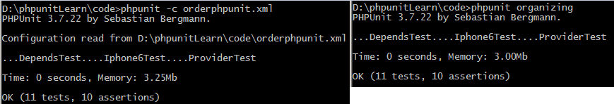
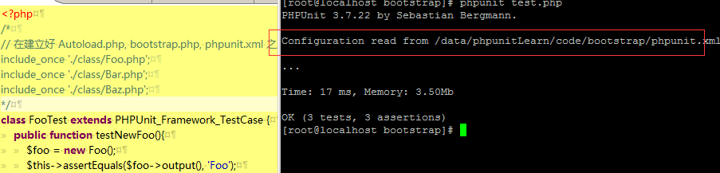

## 组织测试

在之前所有的测试中，我们每次都只是测试一次文件，用来学习 PHPUnit 的知识还好，如果是在实际开发中，难道我们还要一个文件一个文件地输入命令进行测试吗？那肯定是不可以的啦。我们希望在 PHPUnit 中存在某种方法，可以让我们一次测试就可以测试N多的文件，甚至是一条命令就搞定了整个项目的所有测试。

我们这节课的任务就是要完成上面的要求啦：用一条命令就搞定指定的测试。

### 用文件系统来编排测试套件

这种方法就是把所有测试用例源文件放在一个目录内，然后让 PHPUnit 通过对目录进行递归，自动运行测试。

用 PHPUnit 命令行测试一个目录时，只有目录下的 *Test.php 文件才会被测试运行。那我们就新建一个 organizing/ 目录，然后把我们之前用过的几个测试放进去吧，记得修改文件名哦。


(记得修改 iphone6Test.php ，让测试通过哦)


但我们很好奇它的测试顺序又是如何的？我们在这些 *Test.php 文件中添加一些代码，比如添加 echo `__CLASS__`; 然后运行测试


那有没有办法控制测试文件的顺序呢？

提问：你知道为什么 ProviderTest 为什么会跑到上面了吗？如果你感兴趣的话，可以查看 providertest.php 文件的提交历史。

### 用 XML 配置测试

下面新建一个XML文件进行练习

```
code/organizing/phpunit.xml
<phpunit>
  <testsuites>
    <testsuite name="mytest">
      <file>organizing/dependsTest.php</file>
      <file>organizing/providerTest.php</file>
      <file>organizing/iphone6Test.php</file>
    </testsuite>
  </testsuites>
</phpunit>
```
注意上面的文件名必须为phpunit.xml。为了验证是否按这个顺序测试，运行测试命令



好像没什么区别，难道是我理解错了？这个问题先放下吧，继续学习后面的内容，说不定以后就搞懂了。

－－－－－暂停这一章节的内容

如果我突然不想用 phpunit.xml 了，难道我每次都需要把它删除，或者是重命令名吗？当然不是啦， phpunit 中有命令可以让我们完成这个任务

```
phpunit --no-configuration
忽略当前工作目录下的 phpunit.xml 与 phpunit.xml.dist。
```

那好，赶快用命令试一下吧。

你可能会有疑问，难道我的测试配置文件名就只能是 phpunit.xml 吗？当然不是啦，对于 xml 文件的读取，还存在着一定的顺序优先级

* PHPUnit -c 或者 PHPUnit --configuration 加上指定的配置文件
* phpunit.xml.dist 文件中指定的配置
* phpunit.xml

### 使用 bootstrap 和 Autoload

在对某个类进行测试的时候，有时候由于存在依赖关系，我们需要在文件中写多个 `include` 来引入需要的文件，像下面这样
```
// test.php
include_once './class/Foo.php';
include_once './class/Bar.php';
include_once './class/Baz.php';

class FooTest extends PHPUnit_Framework_TestCase {
	public function testNewFoo(){
		$foo = new Foo();
		$this->assertEquals($foo->output(), 'Foo');
	}
	
	public function testNewBar() {
		$bar = new Bar();
		$this->assertEquals($bar->output(), 'Bar');
	}
	
	public function testNewBaz() {
		$baz = new Baz();
		$this->assertEquals($baz->output(), 'Baz');
	}
}
```
这样虽然实现了测试的功能，但是代码太难看了，这时我们可以使用 php 的自动加载来解决这个问题。这里会涉及到3个文件，分别如下。
```
// Autoload.php 负责实现自动加载类的功能
class Autoload {
	// 为了演示方便，这里采用了最简单的方式
	public static function loader($className) {
		include_once './class/' . $className . '.php';
	}
}
spl_autoload_register ( array ('Autoload', 'loader' ) );

// bootstrap.php 负责测试的预备工作
include_once 'Autoload.php';

// phpunit.xml 测试配置
<phpunit bootstrap="bootstrap.php">
</phpunit>
```
完成上面3个步骤之后，就可以把 test.php 中的 include 给注释掉啦



参考资料：[PHPUNIT BOOTSTRAP AND AUTOLOADING CLASSES](http://jes.st/2011/phpunit-bootstrap-and-autoloading-classes/)

代码文件在 code/bootstrap/ 下