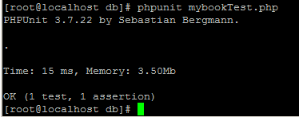
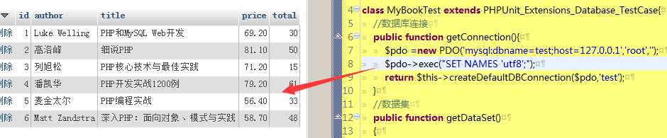
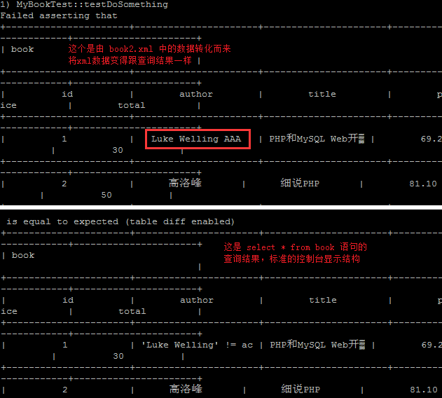
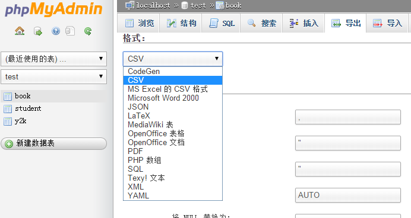

## 数据库测试

你可查看 [官方文档](https://phpunit.de/manual/3.7/zh_cn/database.html) ，但官方文档实在太吝啬文字，看了各种莫名其妙，不知道为啥要那样写代码。所以本节将以 [PHP Master: Write Cutting-edge Code](http://www.sitepoint.com/store/php-master-write-cutting-edge-code/) 中的第7章：自动测试 作为参考指引。


在MVC模式编程中，C层控制着业务的逻辑，通常是测试的重点，包含了大量的数据库操作。从官方文档中我们可以知道，所有的单元测试的范例都不包含数据库交互，因为要处理很多的问题（看文档说明，这里就不重复了），导致测试成本太高。

但是 DbUnit 可以帮助我们简化这些问题，只是测试的时间需要花费一些时间。

#### 数据库测试的5个阶段

1. 清理(TRUNCATE)数据库
2. 建立基境
3. 运行测试
4. 验证结果
5. 拆除基境

新建文件夹 db/ ，用于保存我们演示这5个阶段的代码。然后在 `test` 数据库下新建下面一张测试表

```
CREATE TABLE IF NOT EXISTS `book` (
  `id` int(11) NOT NULL AUTO_INCREMENT,
  `author` varchar(30) NOT NULL,
  `title` varchar(30)  NOT NULL,
  `price` decimal(6,2) NOT NULL,
  `total` int(11) NOT NULL,
  PRIMARY KEY (`id`)
) ENGINE=MyISAM DEFAULT CHARSET=utf8 AUTO_INCREMENT=1 ;
```

然后按照官方的示例，分别新建文件和代码

```
// code\db\myAppDatabaseTest.php
require_once "PHPUnit/Extensions/Database/TestCase.php"; 

abstract class MyApp_Tests_DatabaseTestCase extends PHPUnit_Extensions_Database_TestCase{
    // 只实例化 pdo 一次，供测试的清理和基境读取使用。
    static private $pdo = null;

    // 对于每个测试，只实例化 PHPUnit_Extensions_Database_DB_IDatabaseConnection 一次。
    private $conn = null;

    final public function getConnection()
    {
        if ($this->conn === null) {
            if (self::$pdo == null) {
                self::$pdo = new PDO('sqlite::memory:');
            }
            $this->conn = $this->createDefaultDBConnection(self::$pdo, ':memory:'); 
        }

        return $this->conn; 
    }
}

```

我不知道上面的类名为什么是 MyApp_Tests_DatabaseTestCase，而不是以 *Test 结尾。而且 'sqlite::memory:' 也不熟。官方文档又说，因为上面的配置是固定的，在实际中可能不太方便。为了让每个测试能够单独配置数据库连接信息，可以使用xml配置，然后让我们新建一个 phpunit.xml 文件，内容大概就是这个样子。
```
// code\db\phpunit.xml
<?xml version="1.0" encoding="UTF-8" ?>
<phpunit>
    <php>
        <var name="DB_DSN" value="mysql:dbname=myguestbook;host=localhost" />
        <var name="DB_USER" value="root" />
        <var name="DB_PASSWD" value="" />
        <var name="DB_DBNAME" value="test" />
    </php>
</phpunit>
```
好吧，耐着性子看到这里，我只想说 What the fuck ! 根本不理解好不好(虽然是由于自身技术未到位)，根本就没有考虑过我们这些小白的感受 …… 即然官方的太理论了。我们只能另觅途径了，那就参考 PHP Master: Write Cutting-edge Code 一书吧。哥现在只想做一个实例出来，至于什么理论知识呀，统统靠边站吧。

```
// code\db\mybookTest.php
require_once 'PHPUnit/Extensions/Database/TestCase.php';

class MyBookTest extends PHPUnit_Extensions_Database_TestCase{
	//数据库连接
	public function getConnection(){
		$pdo =new PDO('mysql:dbname=test;host=127.0.0.1','root','');
		return $this->createDefaultDBConnection($pdo,'test');
	}
	//数据集
	public function getDataSet()
	{
		return $this->createFlatXMLDataSet(dirname(__FILE__).'/book.xml');
	}
}
```

数据集有很多种格式，但我已没有兴趣看了，怎么获取数据集？课本告诉我们最简单的方法就是通过 mysqldump 生成，那就来吧。
```
//首先往我们的 `test`.`book` 插入几条数据
INSERT INTO `book` (`id`, `author`, `title`, `price`, `total`) VALUES
(1, 'Luke Welling', 'PHP和MySQL Web开发', 69.20, 30),
(2, '高洛峰', '细说PHP', 81.10, 50),
(3, '列旭松', 'PHP核心技术与最佳实践', 71.20, 15),
(4, '潘凯华', 'PHP开发实战1200例', 79.20, 61),
(5, '麦金太尔', 'PHP编程实战', 56.40, 33),
(6, 'Matt Zandstra', '深入PHP：面向对象、模式与实践', 58.70, 48);
//然后导出为 xml 数据集文件
./mysqldump --xml -t -u [username] -p [database] [tables] > /data/book.xml
```


然后把 book.xml 放到 code/db/ 目录下，注意修改权限。下面开始写测试啦,修改 mybookTest.php 文件
```
require_once 'PHPUnit/Extensions/Database/TestCase.php';

class MyBookTest extends PHPUnit_Extensions_Database_TestCase{
	public function getConnection(){
		$pdo =new PDO('mysql:dbname=test;host=127.0.0.1','root','');
		return $this->createDefaultDBConnection($pdo,'test');
	}
	public function getDataSet()
	{
		return $this->createFlatXMLDataSet(dirname(__FILE__).'/book.xml');
	}
	
	public function testDoSomething(){
		$expected_row_count = 6;
		$actual_row_count = $this->getConnection()->getRowCount('book');
		$this->assertEquals($expected_row_count, $actual_row_count);
		
		$expected_table = $this->createMySQLXMLDataSet('./book.xml')->getTable('bookTest');
		$actual_table = $this->getConnection()->createQueryTable('book', 'SELECT * FROM `book`');
		$this->assertTablesEqual($expected_table, $actual_table);
	}
}
```

运行，第1次错误：

PHPUnit_Extensions_Database_Exception: The root element of a flat xml data set file must be called <dataset>

OK，我改，再次运行，第2次错误：

PHPUnit_Extensions_Database_Operation_Exception:
COMPOSITE[TRUNCATE] operation failed on query:TRUNCATE `database` using args: Array()

[SQLSTATE[42S02]: Base table or view not found: 1146 Table 'test.database' doesn't exist]

你牛，google 一下继续改，最后从[今PHPUnitを使ってDBのテストをしています](http://detail.chiebukuro.yahoo.co.jp/qa/question_detail/q10108361720)看到相关的资料后再修改，新建了一个xml文件

```
//book2.xml
<?xml version="1.0"?>
<dataset>
	<table name="book">
	<column>id</column>
	<column>author</column>
	<column>title</column>
	<column>price</column>
	<column>total</column>
	<row>
		<value>1</value>
		<value>Luke Welling</value>
		<value>PHP和MySQL Web开发</value>
		<value>69.20</value>
		<value>30</value>
	</row>
	...这里补上所有的row记录...
	</table>
</dataset>
```

然后把 mybookTest.php 代码修改如下

```
require_once 'PHPUnit/Extensions/Database/TestCase.php';

class MyBookTest extends PHPUnit_Extensions_Database_TestCase{
	//数据库连接
	public function getConnection(){
		$pdo =new PDO('mysql:dbname=test;host=127.0.0.1','root','');
		return $this->createDefaultDBConnection($pdo,'test');
	}
	//数据集
	public function getDataSet(){
		return $this->createXMLDataSet(dirname(__FILE__).'/book2.xml');//不是createFlatXMLDataSet
	}
	
	public function testDoSomething(){
		$expected_row_count = 6;
		$actual_row_count = $this->getConnection()->getRowCount('book');
		$this->assertEquals($expected_row_count, $actual_row_count);
	}
}
```

然后运行测试，终于通过了



但是我的数据库却变成了下面这个样子……


我们大致可以知道这些代码是由 `$this->createXMLDataSet(dirname(__FILE__).'/book2.xml');` 这一行代码插入的，但为什么会变成乱码呢？我的book2.xml 是 utf8 格式，test.book 和 author,title 也都是 utf8_general_ci 编码格式。那就应该是还差一句设置插入时使用 utf8 编码了。

难道book2.xml 头信息要修改为 <?xml version="1.0"  encoding="UTF-8"?>，不是，还是乱码。想起来了，这应该是对PDO的设置，基础问题呀，居然给忘了，汗……



然后再把 testDoSomething() 修改下

```
public function testDoSomething(){
	$expected_row_count = 6;
	$actual_row_count = $this->getConnection()->getRowCount('book');
	$this->assertEquals($expected_row_count, $actual_row_count);
//添加下面的代码
	$expected_table = $this->createMySQLXMLDataSet('./book.xml')->getTable('book');
	$actual_table = $this->getConnection()->createQueryTable('book', 'SELECT * FROM `book`');
	$this->assertTablesEqual($expected_table, $actual_table);
}
```
再次运行测试，结果为：OK (1 test, 2 assertions)

好不容易，我们终于把数据库测试的实例给搞定了，真是不容易呀。有了代码的基础，我们再来学习理论知识吧，打开 [官方文档](https://phpunit.de/manual/3.7/zh_cn/database.html)。

首先还是数据库的5个阶段。在前面的示例代码中，但每次运行测试的时候，test.book 数据表都会被清空。那么是在getConnection()中还是在getDataSet()中被清空的呢？为了弄清楚这个问题，我们先修改 test.book 中某个记录的值，然后在 getDataSet()的最开始处添加 die(); 再次运行测试，结果发现 test.book 并没有被还原。因此，我们可以得出下面的结论：getConnection()函数只是提供了数据库连接的条件，而 getDataSet() 则会先将数据表清空，然后再加载我们设定的数据。

### 理解 DataSet(数据集) 和 DataTable（数据表）

前面的 getDataSet() 方法用于定义在测试之间，数据库的初始状态。我们只知道它好像进行了 TRUNCATE 操作，然后将我们的xml文件中的数据插入到数据表中，这两个功能都不需要我们编写代码，PHPUnit 的数据库扩展模块就自动帮我们完成了。

数据库扩展模块的核心之一就是 DataSet(数据集)和DataTable（数据表），DataSet 和 DataTable 是对数据库的表、行、列的抽象，模拟关系数据库，把我们的 XML,YAML,CSV 或者 PHP数组 的内容显示得跟我们在控制器使用 sql 语句一样。

下面我们通过一点小代码来帮助理解这段话。

```
//在book.xml随便修改一个值
<value>1</value>
<value>Luke Welling AAA</value>//追加AAA
// mybookTest.php 中只留下面的代码，其它的注释掉
public function testDoSomething(){
	$expected_table = $this->createMySQLXMLDataSet('./book.xml')->getTable('book');
	$actual_table = $this->getConnection()->createQueryTable('book', 'SELECT * FROM `book`');
	$this->assertTablesEqual($expected_table, $actual_table);
}
```
然后运行测试



我们之所以能够实现 xml 数据与实际查询结构相比较，就是多亏了 DataSet/DataTable 在底层的工作啦。我们也知道了，数据库断言的工作流程就是3个步骤组成：

1. 指定数据库的表.(如上面的 book 表)
2. 使用某种格式（如YAML，XML）来指定预期结果集。（如上面的book.xml)
3. 断言两个结果集是否相等。

除了上面基于文件的 DataSet/DataTable ，其实还有基于查询的，还有过滤组合的。

##### 基于文件

第1种文件：XML DataSet，前面我们已经使用过，它调用了 createXMLDataSet 函数，支持的 xml 格式我们也清楚了，可以查看 [book2.xml](./code/db/book2.xml) 。大概就是下面的样子.
```
<?xml version="1.0"  encoding="UTF-8"?>
<dataset>
	<table name="table_name">
	<column>field</column>
	<row>
		<value>field_value</value>
	</row>
</dataset>
```
我现在想知道的是，如何快速地生成这种模式的文件，如何你知道了，记得告诉我哦。

第2种文件 Flat XML DataSet，我们把上面的xml转了 Flat XML
```
<?xml version="1.0" ?>
<dataset>
    <table_name field="field_value" />
</dataset>
//注意第1条<table_name />不允许有NULL的列值 
```
我们新建 flatbook.xml，然后将 book2.xml 的转换内容写在里面，再使用 createFlatXMLDataSet 函数测试一下。OK，走起……搞定了，你可以查看 [flatbook.xml](./code/db/flatbook.xm)，运行测试，你就可以轻松看到我偷偷修改的一个字母啦，只要将它改过来，测试就会通过哦。

第3种文件：MySQL XML DataSet，可以通过 MySQL 命令直接生成（真是太好了……）
```
mysqldump --xml -t -u [username] --password=[password] [database] > /path/to/file.xml
```
它使用的函数是 createMySQLXMLDataSet($filename)，那我们就快点试一下吧，前面我们已经使用过这个命令生成了 book.xml 文件了。那就直接使用它吧，测试结果当然是通过啦。

第4种文件：YAML DataSet

好像还需要安装 Symfony YAML 依赖组件，虽然我没有安装，不过还是建个文件留个足迹吧
```
table_name:
-
	field:value
```
新建 yaml.yml 文件，然后按指定格式编写代码，它使用的代码是 
`return new PHPUnit_Extensions_Database_DataSet_YamlDataSet(dirname(__FILE__)."yaml.yml");`

因为我没有安装组件，所以测不了这个。

第5种文件：CSV DataSet

我记得 mysql 还有很多软件（像手机通讯录）好像可以导出这个格式的文件。

以上各种数据格式，你都可以通过 phpmyadmin 快速地导出来哦。虽然我成功地导出了 csv 文件，但是很遗憾的是并没有测试成功。不过没关系啦，以后应该很少用这种格式的数据文件啦。



第5种格式：直接使用PHP的数组，太好了，赶快试一试吧。代码如下
```
return new MyApp_DbUnit_ArrayDataSet(array(
'book'=>array(
		array("id"=>1, "author"=>"luke Welling", "title"=>"PHP和MySQL Web开发", "price"=>69.20, total=>30),
		array("id"=>2, "author"=>"高洛峰", "title"=>"细说PHP", "price"=>81.10, total=>50),
		array("id"=>3, "author"=>"列旭松", "title"=>"PHP核心技术与最佳实践", "price"=>71.20, total=>15),
		array("id"=>4, "author"=>"潘凯华", "title"=>"PHP开发实战1200例", "price"=>79.20, total=>61),
		array("id"=>5, "author"=>"麦金太尔", "title"=>"PHP编程实战", "price"=>56.40, total=>33),
		array("id"=>6, "author"=>"Matt Zandstra", "title"=>"深入PHP：面向对象、模式与实践", "price"=>58.70, total=>48)
		)
));
```
运行，提示 `PHP Fatal error:  Class 'MyApp_DbUnit_ArrayDataSet' not found`。哦，原来还有个类文件没有建，按照官方提示的代码，新建了文件，但运行结果还是失败。

算了，我还是乖乖地用 mysqldump 导出来的sql格式文件吧。

#### Query (SQL) DataSet
这个讲什么内容，说真的我也不清楚，跳过吧。

