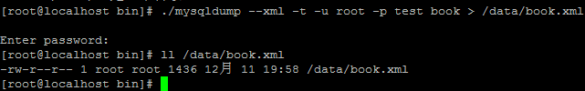

## 数据库测试

你可查看 [官方文档](https://phpunit.de/manual/3.7/zh_cn/database.html) ，但官方文档实在太吝啬文字，看了各种莫名其妙，不知道为啥要那样写代码。所以本节将以 [PHP Master: Write Cutting-edge Code](http://www.sitepoint.com/store/php-master-write-cutting-edge-code/) 中的第7章：自动测试 作为参考指引。


在MVC模式编程中，C层控制着业务的逻辑，通常是测试的重点，包含了大量的数据库操作。从官方文档中我们可以知道，所有的单元测试的范例都不包含数据库交互，因为要处理很多的问题（看文档说明，这里就不重复了），导致测试成本太高。

但是 DbUnit 可以帮助我们简化这些问题，只是测试的时间需要花费一些时间。

#### 数据库测试的5个阶段

1. 清理(TRUNCATE)数据库
2. 建立基境
3. 运行测试
4. 验证结果
5. 拆除基境

新建文件夹 db/ ，用于保存我们演示这5个阶段的代码。然后在 `test` 数据库下新建下面一张测试表

```
CREATE TABLE IF NOT EXISTS `book` (
  `id` int(11) NOT NULL AUTO_INCREMENT,
  `author` varchar(30) NOT NULL,
  `title` varchar(30)  NOT NULL,
  `price` decimal(6,2) NOT NULL,
  `total` int(11) NOT NULL,
  PRIMARY KEY (`id`)
) ENGINE=MyISAM DEFAULT CHARSET=utf8 AUTO_INCREMENT=1 ;
```

然后按照官方的示例，分别新建文件和代码

```
// code\db\myAppDatabaseTest.php
require_once "PHPUnit/Extensions/Database/TestCase.php"; 

abstract class MyApp_Tests_DatabaseTestCase extends PHPUnit_Extensions_Database_TestCase{
    // 只实例化 pdo 一次，供测试的清理和基境读取使用。
    static private $pdo = null;

    // 对于每个测试，只实例化 PHPUnit_Extensions_Database_DB_IDatabaseConnection 一次。
    private $conn = null;

    final public function getConnection()
    {
        if ($this->conn === null) {
            if (self::$pdo == null) {
                self::$pdo = new PDO('sqlite::memory:');
            }
            $this->conn = $this->createDefaultDBConnection(self::$pdo, ':memory:'); 
        }

        return $this->conn; 
    }
}

```

我不知道上面的类名为什么是 MyApp_Tests_DatabaseTestCase，而不是以 *Test 结尾。而且 'sqlite::memory:' 也不熟。官方文档又说，因为上面的配置是固定的，在实际中可能不太方便。为了让每个测试能够单独配置数据库连接信息，可以使用xml配置，然后让我们新建一个 phpunit.xml 文件，内容大概就是这个样子。
```
// code\db\phpunit.xml
<?xml version="1.0" encoding="UTF-8" ?>
<phpunit>
    <php>
        <var name="DB_DSN" value="mysql:dbname=myguestbook;host=localhost" />
        <var name="DB_USER" value="root" />
        <var name="DB_PASSWD" value="" />
        <var name="DB_DBNAME" value="test" />
    </php>
</phpunit>
```
好吧，耐着性子看到这里，我只想说 What the fuck ! 根本不理解好不好(虽然是由于自身技术未到位)，根本就没有考虑过我们这些小白的感受 …… 即然官方的太理论了。我们只能另觅途径了，那就参考 PHP Master: Write Cutting-edge Code 一书吧。哥现在只想做一个实例出来，至于什么理论知识呀，统统靠边站吧。

```
// code\db\mybookTest.php
require_once 'PHPUnit/Extensions/Database/TestCase.php';

class MyBookTest extends PHPUnit_Extensions_Database_TestCase{
	//数据库连接
	public function getConnection(){
		$pdo =new PDO('mysql:dbname=test;host=127.0.0.1','root','');
		return $this->createDefaultDBConnection($pdo,'test');
	}
	//数据集
	public function getDataSet()
	{
		return $this->createFlatXMLDataSet(dirname(__FILE__).'/book.xml');
	}
}
```

数据集有很多种格式，但我已没有兴趣看了，怎么获取数据集？课本告诉我们最简单的方法就是通过 mysqldump 生成，那就来吧。
```
//首先往我们的 `test`.`book` 插入几条数据
INSERT INTO `book` (`id`, `author`, `title`, `price`, `total`) VALUES
(1, 'Luke Welling', 'PHP和MySQL Web开发', 69.20, 30),
(2, '高洛峰', '细说PHP', 81.10, 50),
(3, '列旭松', 'PHP核心技术与最佳实践', 71.20, 15),
(4, '潘凯华', 'PHP开发实战1200例', 79.20, 61),
(5, '麦金太尔', 'PHP编程实战', 56.40, 33),
(6, 'Matt Zandstra', '深入PHP：面向对象、模式与实践', 58.70, 48);
//然后导出为 xml 数据集文件
./mysqldump --xml -t -u [username] -p [database] [tables] > /data/book.xml
```


然后把 book.xml 放到 code/db/ 目录下，注意修改权限。下面开始写测试啦,修改 mybookTest.php 文件
```
require_once 'PHPUnit/Extensions/Database/TestCase.php';

class MyBookTest extends PHPUnit_Extensions_Database_TestCase{
	public function getConnection(){
		$pdo =new PDO('mysql:dbname=test;host=127.0.0.1','root','');
		return $this->createDefaultDBConnection($pdo,'test');
	}
	public function getDataSet()
	{
		return $this->createFlatXMLDataSet(dirname(__FILE__).'/book.xml');
	}
	
	public function testDoSomething(){
		$expected_row_count = 6;
		$actual_row_count = $this->getConnection()->getRowCount('book');
		$this->assertEquals($expected_row_count, $actual_row_count);
		
		$expected_table = $this->createMySQLXMLDataSet('./book.xml')->getTable('bookTest');
		$actual_table = $this->getConnection()->createQueryTable('book', 'SELECT * FROM `book`');
		$this->assertTablesEqual($expected_table, $actual_table);
	}
}
```

运行，第1次错误：

PHPUnit_Extensions_Database_Exception: The root element of a flat xml data set file must be called <dataset>

OK，我改，再次运行，第2次错误：

PHPUnit_Extensions_Database_Operation_Exception:
COMPOSITE[TRUNCATE] operation failed on query:TRUNCATE `database` using args: Array()

[SQLSTATE[42S02]: Base table or view not found: 1146 Table 'test.database' doesn't exist]

你牛，google 一下继续改，


