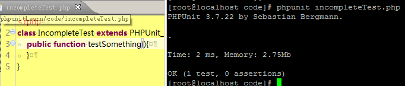
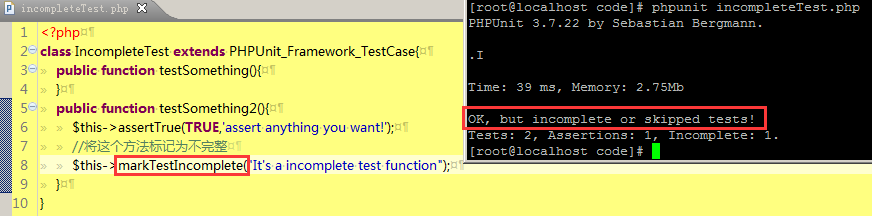
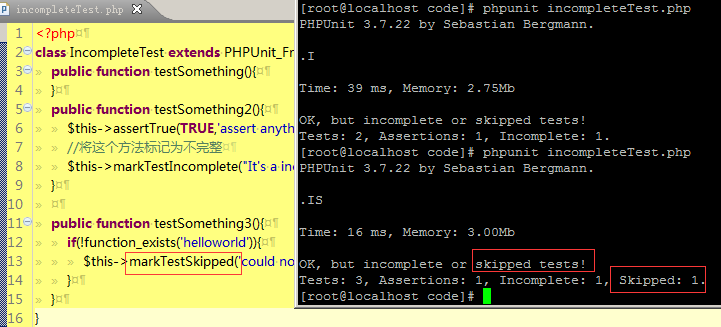

首先在 code/ 目录下新建一个 incompleteTest.php 文件，并编写下面的代码
```
// code/incompleteTest.php
class IncompleteTest extends PHPUnit_Framework_TestCase{
	
}
```

打开 [官方文档](https://phpunit.de/manual/3.7/zh_cn/incomplete-and-skipped-tests.html)，开始我们的学习。

### 不完整的测试

在上面的类中添加官方提供的代码，然后运行测试，结果如下



对于空的测试方法， PHPUnit 将其解读为成功。在这种情况下，当我们的测试报告显示结果为“成功”时，事实上就有两种情况：1测试代码真的成功了；2还没有编写测试代码。为了避免出现第2种情况，对于还没有编写测试代码的方法，我们需要将其标记为不完整的测试。继续使用官方提供的代码编辑我们的 incompleteTest.php 文件。



OK，感觉不是很难就完成了。

### 跳过测试

有的时候由于受到服务器环境的限制，比如某个扩展没有被开启，某个方法不存在在呀，那么测试就会直接 Error 挂掉，这个时候，我们也许可以使用跳过测试先应付一下。



### 用 @requires 来跳过测试

可以使用 @requires 来标记测试的条件，比如只有符合一定的 PHP版本，PHPUnit版本，存在方法，存在扩展 的条件下才进行测试。

OK，这一章节的内容比较简单，最终的代码文章在这里，你可以查看 [incompleteTest.php](./code/incompleteTest.php)