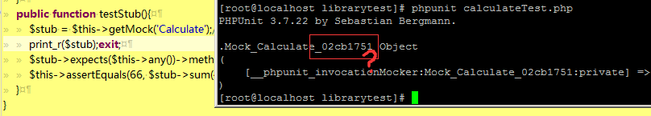

## 测试替身

什么是测试替身？Sorry,I don't known; 但如果让我看一个实例，也许我就会明白啦，可惜的是我连这个实例应该怎么写都不知道。看看 [官方文档](https://phpunit.de/manual/3.7/zh_cn/test-doubles.html) 给我们提供哪些知识吧。

暂时不明白的知识

* 测试替身的概念
* 短连件(Stub)

也许有用的提示

* 使用 getMock() 可以建立一个短连件对象

现在我们已经有了自知之明啦，再加上官方的代码，我想肯定可以搞定那两个不明白的概念的，好，开始吧。

参考 官方教程 和 《PHP Master: Write Cutting-edge Code》，新建下面的文件和代码
```
// librarytest/calculateTest.php
require_once '../library/calculate.class.php';
class CalculateTest extends PHPUnit_Framework_TestCase{
	private $stub;
	public function setUp(){
		$this->stub = $this->getMock('Calculate');
	}

	public function testStub(){
		$this->stub->expects($this->any())->method('sum')->with(16,50)->will($this->returnValue(66));
	}
}
```
代码写好了，运行结果为：OK (2 tests, 2 assertions)

好，现在开始分析代码。当使用 getMock() 方法时，会生成一个测试替身类，那我们就把这个所谓的测试替身类打印出来，看看是什么样子的。



暂时看不出来什么信息，继续看文档。"所生成的测试替身类可以通过 getMock() 的可选参数进行配置"，好像我们上面没有使用到哦，那好，看下 getMock()方法的声明，但是好像得不到什么信息，跳过继续阅读文档。

默认情况下，测试替身的所有方法都返回NULL值，除非用will->($this->returnValue()) 之类的方法去修改它。
```
// 参考 《PHP精粹》 第7单元，P169
public function testStub(){
	$this->stub->expects($this->any())->method('sum')->with(16,50)->will($this->returnValue(66));
}
/*
expects($matcher):接受一个方法的引用，或者是将被模拟方法需要执行多少次
method():指出测试替身中哪一个方法将被模拟
with():相当于传递给方法的参数
will():指定方法调用的结果
*/
```
还是不太清楚，修改 library/calculate.class.php 文件，添加一个方法，再进行测试
```
// library/calculate.class.php
...
public function double($a){
	return $a * 2;
}
...
// librarytest/calculateTest.php
public function testStub3(){
	$stub = $this->getMock('Calculate');
	$stub->expects($this->any())->method('sum')->will($this->returnValue(66));
	$stub->expects($this->any())->method('double')->will($this->returnValue(16));
	$this->assertEquals(66, $stub->sum(44,22));
	$this->assertEquals(16, $stub->double(8));
}
// OK (2 tests, 4 assertions) 为什么有4个断言？
```

添加代码 `print_r($stub);`，然后根据打印现来的信息，大概可以知道上面的两行代码在内部是这个样子的（这里是便于理解）
```
$stub = array('matchers'=>array(
	array('method'=>'sum','parameters'=>66),
	array('method'=>'dobule','parameters'=>16)
));
```

现在我们可以猜测一下，`$stub->sum(44,22)` 本身就已经与 parameters 返回值进行了比较，为了验证我们的猜想，删除 $this->assertEquals()。
```
public function testStub3(){
	$stub = $this->getMock('Calculate');//为 Calculate 类创建短连件
	$stub->expects($this->any())->method('sum')->will($this->returnValue(66));
	$stub->expects($this->any())->method('double')->will($this->returnValue(16));
	$stub->sum(44,21);
	$stub->double(8);
}
// OK (2 tests, 2 assertions)
```

很好，验证了我们的猜测。同时，$stub 也是类 Calculate 是一个实例，我们可以使用它来调用 类中任何公开的方法。

写了这么多，我还是搞不懂测试替身有什么用呀……之所以没有删除上面的文字，只是想告诉你，有时候找到一本好的参考书是多么重要。像 phpunit 官方这种文档，只能让你越看越伤心。浪费了太多的时间了，我们重新开始学习吧。我们的参考资料是 [PHP Master: Write Cutting-edge Code](http://www.sitepoint.com/store/php-master-write-cutting-edge-code/) 的第7章 。Let's go...

如果类A中实例化了类B，那么在测试类A时，我们就可以制作类B的替身了（就像电影明星的替身一样，可以起到以假乱真的作用）。使用测试替身的好处在于：

* 减少依赖耦合
* 缩短测试时间，运行更加稳定
* 同时能对内部的输入输出进行验证，测试更彻底

那我们开始来体验一下吧。我们需要以下3个文件

```
// library/calculate.class.php 我们在上面已经使用过了
class Calculate{
	public function sum($a,$b){
		return $a + $b;
	}
}
// library/calAdd.class.php
require_once dirname(__FILE__).'/calculate.class.php';

class Double{
	private $_calculator = null;
	
	public function getCalculate(){
		if(empty($this->_calculator))
			$this->_calculator = new Calculate();
		return $this->_calculator;
	}
	
	public function setCalculate(Calculate $calculator){
		$this->_calculator = $calculator;
	}
	
	private $_nums = array();
	public function append($num){
		array_push($this->_nums, intval($num));
	}
	
	public function total(){
		$cal = $this->getCalculate();
		$total = 0;
		if(!empty($this->_nums)){
			foreach($this->_nums as $n){
//引用类用到了自身的方法，将来测试替身必须规定这个方法如何实现
				$total = $cal->sum($n,$total);
			}
		}
		return $total;
	}
}
// librarytest/calAddTest.php
require_once dirname(dirname(__FILE__)).'/library/calAdd.class.php';

class calAddTest extends PHPUnit_Framework_TestCase{
	
	private $_calAdd = null;
	private $_calculator = null;
	
	public function setup(){
		$this->_calAdd = new calAdd();//要测试的类
		$this->_calculator = $this->getMock('Calculate');//测试类中的替身
		$this->_calAdd -> setCalculate($this->_calculator);
	}
	
	public function testTotal(){
		$this->_calAdd->append(29);
/*
$this->_calAdd->total() 方法中使用到了代码 $total = $cal->sum($n,$total);
测试替身必须 $cal->sum() 将如何实现
*/
		$this->_calculator->expects($this->at(0))->method('sum')->with(29,0)->will($this->returnValue(29));
/*
第1次循环时：调用代码为 29 = $cal->sum(29,0);
第1个29为返回值，第2个29是我们 append(29) 时添加的。
*/
		$this->assertEquals(29, $this->_calAdd->total());
	}
}
```

如果你看懂了上面的代码，那么继续为 calAddTest.php 中添加更加复杂的测试代码
```
public function testTotal2(){
	//记住 $cal->sum($n,$total) 中参数的顺序
	$this->_calAdd->append(45);
	$this->_calculator->expects($this->at(0))->method('sum')->with(45,0)->will($this->returnValue(45));
	$this->_calAdd->append(76);
	$this->_calculator->expects($this->at(1))->method('sum')->with(76,45)->will($this->returnValue(121));
	$this->_calAdd->append(14);
	$this->_calculator->expects($this->at(2))->method('sum')->with(14,121)->will($this->returnValue(135));
	$this->assertEquals(135, $this->_calAdd->total());
}
//还有其它两个测试，可以查看 calAddTest.php 文件
```

使用测试替身时，我们可以对待测类A中使用到的类B的每一个输入（使用with()）输出（使用will()）进行更加细致的检测，而这些是使用 new 类B 所无法拥有的。

对于返回值，除了上面的 `returnValue($value)` 返回固定值外，还有以下几种类型
```
*** returnArgument($int); 返回第$int传入的参数(未改变的值) ***
// calculate.class.php
public static $_mc = 0;
public function mc($num){
	self::$_mc = $num;
	return $num;
}
// calAdd.class.php
public function mc($num){
	$cal = $this->getCalculate();
	return $cal->mc($num);
}
// calAddTest.php
public function testMc(){
	$this->_calculator->expects($this->any())->method('mc')->will($this->returnArgument(0));
	$this->assertEquals(75, $this->_calAdd->mc(75));
}
// OK (1 test, 2 assertions)

*** returnSelf(); 返回测试替身本身 ***
// calculate.class.php
public function madd($num){
	self::$_mc += $num;
	return $this;
}
// calAdd.class.php
public function madd($num){
	$cal = $this->getCalculate();
	return $cal->madd($num);
}
// calAddTest.php
public function testmadd(){
	$this->_calculator->expects($this->any())->method('madd')->will($this->returnSelf());
	$this->assertEquals($this->_calculator, $this->_calAdd->madd(70));
}
//OK (1 test, 2 assertions)

*** returnValueMap($map);从参数到返回值的映射 ***
// calAdd.class.php
public function sum($num1,$num2){
	$cal = $this->getCalculate();
	return $cal->sum($num1,$num2);
}
// calAddTest.php
public function testReturnValueMap(){
	$map = array(
			array(15,14,29),
			array(25,33,58)
			);
	$this->_calculator->expects($this->any())->method('sum')->will($this->returnValueMap($map));
	$this->assertEquals(29, $this->_calAdd->sum(15,14));
	$this->assertEquals(58, $this->_calAdd->sum(25,33));
}

//OK (1 test, 3 assertions)
*** returnCallback($func);返回回调函数 ***
// calculate.class.php
public function date($format){
	return date($format);
}
// calAdd.class.php
public function date($format){
	$cal = $this->getCalculate();
	return $cal->date($format);
}
// calAddTest.php
public function testDate(){
	$this->_calculator->expects($this->any())->method('date')->will($this->returnCallback('date'));
	$this->assertEquals('2014-12-14', $this->_calAdd->date('Y-m-d'));
}
// OK (1 test, 2 assertions)

*** onConsecutiveCalls($parms...); 返回指定列表中的值 ***
// calculate.class.php
public function rand(){
	return rand(1, 4);
}
// calAdd.class.php
public function calType(){
	$cal = $this->getCalculate();
	switch ($cal->rand()){
		case 1: return 'add';break;
		case 2: return 'subtract';break;
		case 3: return 'multiply';break;
		case 4: return 'divide';break;
		default: return 'error';
	}
}
// calAddTest.php
public function testCalType(){
	$this->_calculator->expects($this->any())->method('rand')->will($this->onConsecutiveCalls(1,2,3,4));//即是返回值范围，也是返回的顺序
	$this->assertEquals('add', $this->_calAdd->calType());
	$this->assertEquals('subtract', $this->_calAdd->calType());
	$this->assertEquals('multiply', $this->_calAdd->calType());
	$this->assertEquals('divide', $this->_calAdd->calType());
}
//OK (1 test, 5 assertions)

*** throwException();抛出一个异常 ***
// Tests: 1, Assertions: 0, Errors: 1.
// calAdd.class.php
public function divide($num){
	if($num == 0)
		throw new Exception('Division by zero');
}
// calAddTest.php
public function testDivide(){
	$stub = $this->getMock('calAdd');
	$stub->expects($this->any())->method('divide')->will($this->throwException(new Exception('Division by zero')));
	$stub->divide(0);
}
// 不知道哪里错了
```

现在，再来回答最开始的两个问题，什么是测试替身，什么是短连件。测试替身是用于代替依赖的对象，而短连件则是通过代码 getMock() 返回的类的实例，也即是测试替身。

### 仿件对象

通过使用测试替身，而不是对象来执行调用方法，并且验证行为结果的过程，称为 mocking 模仿。你可以使用仿件对象（mock object）作为一个用来验证被测系统（SUT）执行时的直接输出结果的观察点。通常，仿件对象还包括短连件的功能 —— 如果测试没有失败，则需向被测系统返回值，并验证返回值。因此，仿件对象不仅仅是简单的短连件+断言"

下面展示如何使用仿件来对观察者模式进行测试
```
// library/subject.php
class Subject{
	protected $stuList = array();
	// 添加学生（被通知对象）
	public function addStu(Student $stu){
		$this->stuList[] = $stu;
	}
	// 调用每个学生的 update 动作
	public function notify($args){
		foreach($this->stuList as $stu){
			$stu->update($args);
		}
	}
	public function warn(){
		$this->notify('The teacher is coming!');
	}
}

class Student{
	public function update($args){}
}

class Student1 extends Student{
	public function update($args){
		echo 'OH,NO';
	}
}
class Student2 extends Student{
	public function update($args){
		echo 'OVER';
	}
}
// librarytest/subjectTest.php
require_once '../library/subject.php';

class SubjectTest extends PHPUnit_Framework_TestCase{
	public function testObserversUpdate(){
		//建立仿件对象，被通知的学生，只模仿update()方法
		$student1 = $this->getMock('Student1',array('update'));
		$student1->expects($this->once())->method('update')->with($this->equalTo('The teacher is coming!'));
		
		$student2 = $this->getMock('Student1',array('update'));
		$student2->expects($this->once())->method('update')->with($this->equalTo('The teacher is coming!'));
		
		$subject = new Subject();
		$subject->addStu($student1);
		$subject->addStu($student2);
		$subject->warn();
	}
}
// OK (1 test, 2 assertions)
```

with()方法可以携带任何数据的参数，对应于被模仿的方法的参数数量，还可以对方法的参数指定更加高等的约束。比如 `$student2->expects($this->once())->method('update')->with($this->stringContains('teacher'));` 也是可以通过测试的。如果是整数，还可以使用 `$this->greaterThan($int)` 来进行约束。甚至可以使用callback()来进行约束，如`$student2->expects($this->once())->method('update')->with($this->callback(function($msg){ return $msg =='The teacher is coming!';}));`

上面我们在expects()中使用到了$this->once()和$this->at(0)，这些都称为匹配器matchers，它们分别代表：

* any() 方法执行0或任意次数时匹配成功
* never() 从未执行时匹配成功
* atLeastOnce() 执行至少一次时匹配成功
* once() 执行恰好一次时匹配成功
* exactly(int $count) 执行 $count 次时匹配成功
* at(int $index) 执行第 $index 次时匹配成功，从0开始

#### 对 Web 服务进行短连和模仿

当应用程序需要和 web 服务进行交互时，会想要在不与 web 服务进行实际交互的情况下对其进行测试，可以使用 getMockFromWsdl() 来进行测试。

Sorry，官方的例子我看不懂，所以不知道这个有什么用。

#### 对文件系统进行模仿

需要安装 vfsStream，我没有安装，所以也就跳过去了。


#### 其它资料：
[探索 Test Double 的状态集](http://msdn.microsoft.com/zh-cn/magazine/cc163358.aspx)